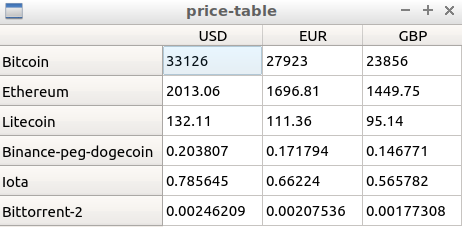

This is a GUI app that gets prices of given crypto currencies from coingecko API and shows them in a table. 

You should have QT installed to run the program.


Run these commands in price-table folder to compile the program:
```qmake```, followed by ```make```.

Then export the path of *crypto-list.txt* like so: 

```export MYCRYPTOCONVERT={path of this folder}/crypto-list.txt```. 

If you have network connection, prices of currencies will be shown in a table when you run ```./price-table```.

